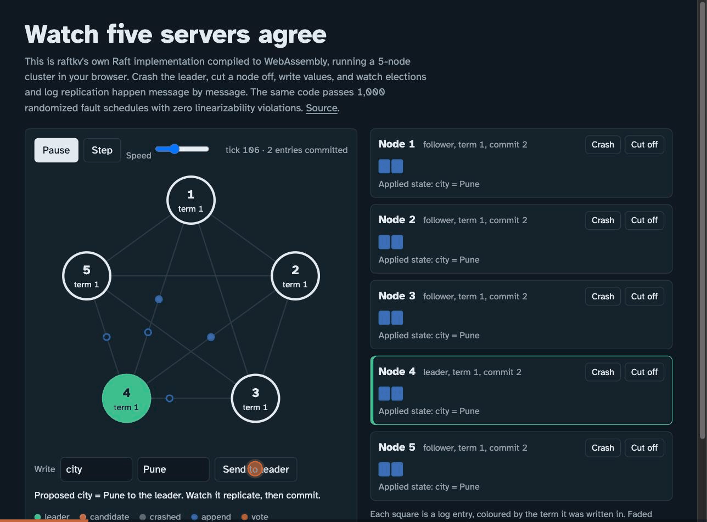
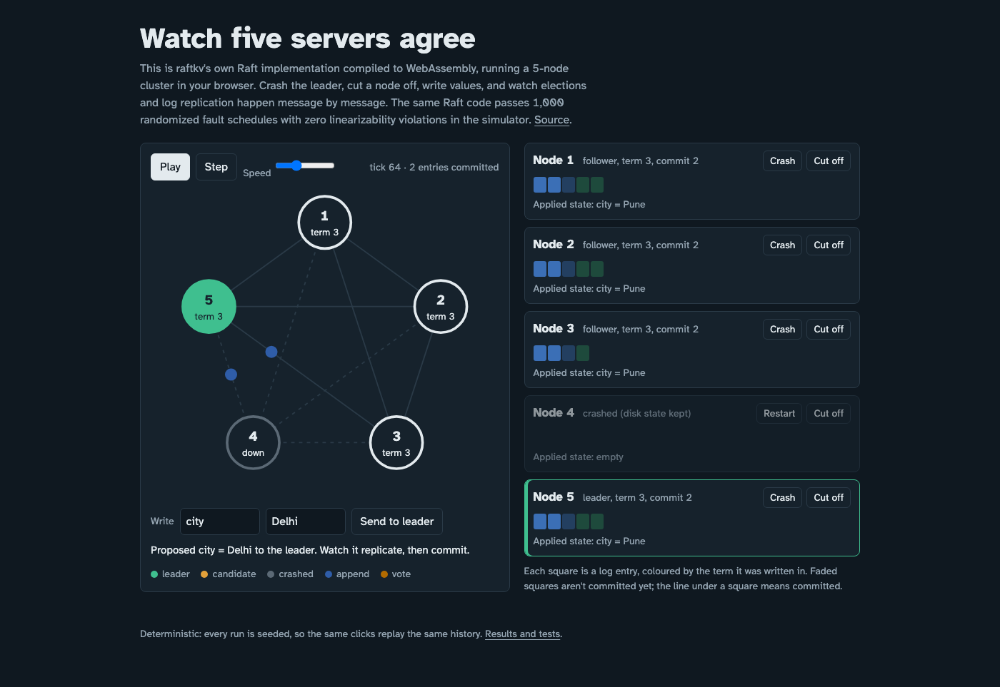
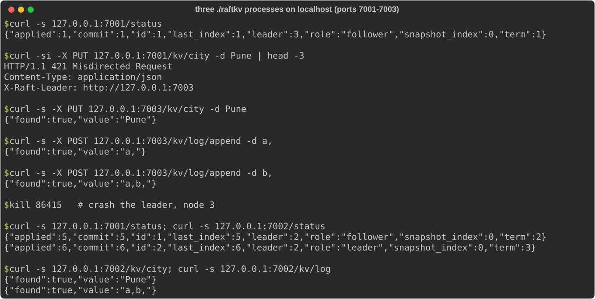

# raftkv

> **Credits.** Built by Amaan Mithani with Claude (Anthropic) as the AI coding assistant.

[](https://github.com/amaanmithani/raftkv/actions/workflows/ci.yml)

A replicated key-value store on a **from-scratch implementation of Raft**, with no
consensus library. It's checked for linearizability under randomized faults, and the
checker itself is tested by injecting classic consensus bugs to show it catches them.
The same code runs as real processes (write-ahead log, HTTP) and, compiled to
WebAssembly, in the browser.



## Screenshots



The WASM visualizer (`web/`, built as in `web/README.md` and served locally), stopped at tick 64: `city = Pune` was committed, node 4 (the leader) was crashed, node 5 won the election in term 3, and a new write (`city = Delhi`) is replicating.



Three real `raftkv` processes on one laptop, started as in [Run it](#run-it): a follower redirects a write with `421` and `X-Raft-Leader`, the leader takes the writes, then the leader process is killed and the survivors elect a new leader that still has the data.

## How it's built

```
          ┌────────────── raft: a pure state machine ──────────────┐
          │ Tick() · Step(msg) · Propose(data) · Ready() · Advance() │
          │  no I/O, no clock, no goroutines                        │
          └──────────────┬──────────────────────────┬──────────────┘
      sim driver         │                          │        node driver
  seeded network, virtual clock,                 real processes: HTTP transport,
  partitions, crash/restart from disk,           CRC-checked WAL + group commit,
  safety invariants every step, WASM             KV HTTP API with leader redirects
                         └──────── kv state machine ─┘
                     Get/Put/Append · client sessions (exactly-once retries)
```

Keeping the algorithm free of I/O is what makes it testable. The simulator can run a
thousand fault schedules in seconds, and any failure replays exactly from its seed.

**Raft features:** leader election with randomized timeouts, **PreVote** (a
partitioned node can't depose a healthy leader when it rejoins), **CheckQuorum**
(an isolated leader steps down), log replication with the conflict-term
**fast backup**, pipelined appends, commit only by current-term entries (§5.4.2),
**snapshots** with log compaction and `InstallSnapshot` for lagging followers.

**Safety invariants** checked after every simulated step: election safety, log
matching, leader completeness, state-machine safety. Client histories are checked
for **linearizability** with [Porcupine](https://github.com/anishathalye/porcupine).

## Run it

```bash
# A 3-node cluster on one machine
go build -o raftkv ./cmd/raftkv
P=1=http://127.0.0.1:7001,2=http://127.0.0.1:7002,3=http://127.0.0.1:7003
./raftkv -id 1 -peers $P & ./raftkv -id 2 -peers $P & ./raftkv -id 3 -peers $P &

curl -X PUT  127.0.0.1:7001/kv/city -d Pune        # followers answer 421 + X-Raft-Leader
curl -X POST 127.0.0.1:7001/kv/log/append -d a,
curl         127.0.0.1:7001/kv/city                 # reads go through the log: linearizable
curl         127.0.0.1:7001/status
```

Send `X-Client-ID` and `X-Seq` headers and a retried request is applied exactly once.

```bash
go test -race ./...                                  # unit, scenario, simulation, 3-process cluster
go run ./cmd/linearize -schedules 1000               # randomized fault schedules + Porcupine
python3 scripts/mutations.py                         # inject bugs; the harness must catch them
scripts/throughput.sh                                # real processes, 3/5/7 nodes
```

## Results

Rendered by `scripts/report.py` from `results/*.json`.

<!-- RESULTS:START -->
### Linearizability under faults

1000 seeded schedules (seeds 1..1000), each: 5 nodes, 6 clients x 30 ops on 3 keys, 800 steps of nemesis (random splits, leader isolation, crashes with and without immediate restart, leader crashes, 0-40% message loss, 1-4 tick delays with reordering, message duplication), then healing. PreVote, CheckQuorum, append batch size, snapshot interval (down to every entry), duplication rate and fault frequency are randomized per seed. Raft safety invariants checked during the run; history checked with Porcupine.

**1,000 schedules, 0 violations, 0 inconclusive checks.** 180,000 client operations checked (reads and writes, all through the log); 16,925 crashes, 19,315 partitions, 9,645 leader terms, 418,210 of 6,162,106 messages dropped. 74% of operations were in flight during an active fault; 38% only completed after the healing phase. Wall time 9 s on 8 cores.

**Scope.** The randomized harness exercises the pure Raft and KV code under an idealized storage model (writes are atomic, crashes happen between steps). Client replies are never lost, so uncertainty comes only from timeouts and retries. The real server's storage and crash ordering are covered separately by storage and cluster tests (below).

### Does the harness catch real bugs?

A checker that never fails proves nothing, so each bug below was injected into a copy of the code and the harness was run against it (300 randomized schedules per core bug with a 3 s checker limit per history, where a timeout counts as not caught; plus the scenario, storage and cluster tests). **10 of 11 caught: 4 by randomized schedules, the rest only by tests written for them.** Misses are listed, not hidden.

| injected bug | where | randomized harness | targeted tests |
|---|---|---|---|
| Voters skip the up-to-date log check (§5.4.1) | raft/kv core | 138/300 schedules fail: leader completeness: leader 2 (term 6) lacks committed entry 41 (seed 1, t=129) | — |
| A node may vote for several candidates in one term | raft/kv core | 218/300 schedules fail: election safety: nodes 1 and 3 both led term 6 (seed 1, t=131) | `TestVotePersistsAcrossCrash` |
| Leader commits earlier-term entries by counting replicas (Figure 8 bug) | raft/kv core | not caught | `TestFigure8` |
| Follower commits up to the leader's index without checking its log matches that far | raft/kv core | not caught | `TestFollowerCommitsOnlyVerifiedPrefix` |
| The vote isn't persisted, so a restarted node can vote twice in a term | raft/kv core | not caught | `TestVotePersistsAcrossCrash` |
| The state machine re-executes retried requests | raft/kv core | 248/300 schedules fail: non-linearizable history | — |
| Installing a snapshot keeps the old log suffix in storage (found by review) | raft/kv core | 36/300 schedules fail: persisted log of node 3 splices histories (terms decrease) (seed 4, t=468) | `TestSnapshotInstallDropsStoredSuffix` |
| A leader keeps leading after an append response shows a higher term (found by review) | raft/kv core | not caught | `TestLeaderStepsDownOnHigherTermResponse` |
| Real server sends messages before persisting the Ready batch | real server | n/a (doesn't run the server) | **missed** |
| Real server's WAL never stores log entries | real server | n/a (doesn't run the server) | `TestClusterSurvivesLeaderCrashAndRestart` |
| Real server keeps the stale WAL suffix when installing a snapshot (found by review) | real server | n/a (doesn't run the server) | `TestStorageInstalledSnapshotDropsSuffix` |

Some bugs need timing that random schedules almost never produce, such as the leader-change sequence in Figure 8 of the Raft paper, so they're covered by scripted scenario tests that drive exact message interleavings. Bugs that only matter when a real disk is interrupted mid-write (for example sending before persisting) are the weak spot: the simulator can't see them and the cluster test doesn't crash at the right instant.

### Throughput and latency vs cluster size

all nodes and the load generator on one machine (localhost HTTP); 32 and 128 concurrent clients (one run each), sequential PUTs of 64-byte values over 1,000 keys for 20s after a 3s warm-up; each request commits through the log; fsync on = the WAL record for each batch is fsynced before messages are sent (group commit). On macOS Go's File.Sync is F_FULLFSYNC, a full flush of the drive cache, much slower than Linux fdatasync. Machine: Apple M1 Pro, 8 cores.

| nodes | fsync | clients | writes/s | p50 | p99 | errors |
|---|---|---|---|---|---|---|
| 3 | on | 32 | 602 | 52.8 ms | 94.3 ms | 0 |
| 3 | on | 128 | 2,233 | 54.0 ms | 100.1 ms | 0 |
| 3 | off | 32 | 14,482 | 2.0 ms | 6.7 ms | 0 |
| 3 | off | 128 | 23,454 | 4.9 ms | 12.8 ms | 0 |
| 5 | on | 32 | 402 | 78.2 ms | 147.6 ms | 0 |
| 5 | on | 128 | 1,790 | 66.1 ms | 136.9 ms | 0 |
| 5 | off | 32 | 9,895 | 2.9 ms | 9.3 ms | 0 |
| 5 | off | 128 | 16,111 | 7.1 ms | 19.7 ms | 0 |
| 7 | on | 32 | 399 | 77.4 ms | 155.9 ms | 0 |
| 7 | on | 128 | 1,512 | 77.1 ms | 168.8 ms | 0 |
| 7 | off | 32 | 9,279 | 3.1 ms | 9.5 ms | 0 |
| 7 | off | 128 | 11,621 | 10.2 ms | 28.3 ms | 0 |

Clients are closed-loop (each waits for its reply before sending the next write). Up to 7 nodes and the load generator share 8 cores, so part of the decline with cluster size is CPU contention rather than replication cost; each row is a single run.

With fsync on, latency is set by the disk flush (leader, then followers, in sequence), so throughput scales with concurrency: 3 nodes go from 602 to 2,233 writes/s between 32 and 128 clients at the same p50, because concurrent requests share one WAL record and one fsync (group commit).
<!-- RESULTS:END -->

## Limitations

- Membership is fixed at startup (no joint consensus).
- Reads go through the log. That's simple and linearizable but costs a round of replication; ReadIndex or leases would be faster.
- The throughput numbers come from one machine over localhost, so they measure the implementation and the disk flush, not a network.
- The KV snapshot is a JSON dump of the whole map, fine for a demo-sized store.

Design notes, what broke and how it was found: [docs/WRITEUP.md](docs/WRITEUP.md).
